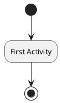
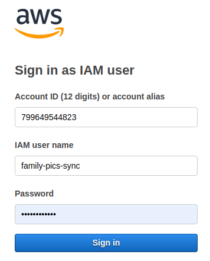
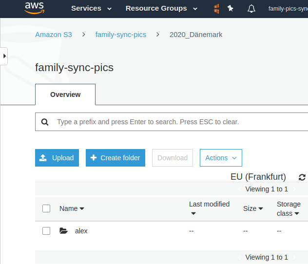
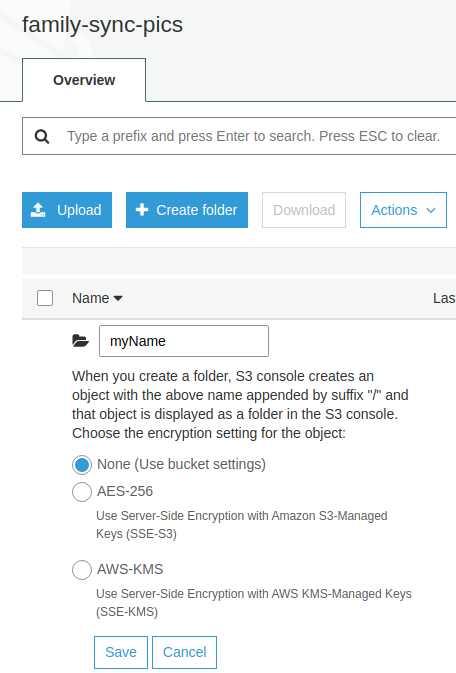
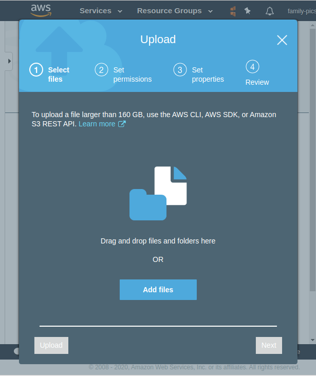
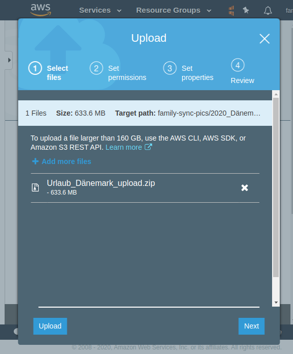

# some useful hints

## ESP8266

* To program the ESP module -> ground GPIO0 before downloading a code.

## documentation

### usage MkDocs

* `mkdocs serve` - Start the live-reloading docs server.
* `mkdocs build` - Build the documentation site.
* `aws s3 sync ./site s3://autohomestack.de` Deploy to s3 bucket
* `mkdocs gh-deploy`  Deploy your documentation to GitHub Pages
* `localhost:8000` to view it in browser
* [https://autohomestack.github.io/website/](https://autohomestack.github.io/website/)

### draw.io

1. Open the XML (or create new one) with [https://www.draw.io/](https://www.draw.io/)

1. Make your changes

1. Export the Image as PNG and get the XML source

### plantuml



* [plantuml examples](http://ogom.github.io/draw_uml/plantuml/)
* [plantuml examples](http://plantuml.com/sitemap-language-specification)
* [plantuml examples](https://real-world-plantuml.com)
* [online editor](https://www.planttext.com)

open **preview at VSC**

* Ctrl + Shift + N -> to open a new window
* point to a different root folder
* Ctrl + Shift + V -> open markdown preview mode
* Alt + D -> to render plantuml

## git bash

cmd|task
-|-
git checkout -b <branch_name>|make new feature branch
git checkout Pre_Master|merge feature branch to Pre_Master
git pull|merge feature branch to Pre_Master
git merge <branch_name>|merge feature branch to Pre_Master
git push --delete origin <branch_name>|delete feature branch
git branch -d <branch_name>|delete feature branch

## S3 sync family pics

### via aws console

* open url [signin.aws.amazon.com/console/s3](https://799649544823.signin.aws.amazon.com/console/s3)

* enter access data

password is provided on another way



* select S3 bucket **family-sync-pics**

at [console.aws.amazon.com/s3/home](https://console.aws.amazon.com/s3/home?region=eu-central-1) klick at **[family-sync-pics](https://console.aws.amazon.com/s3/buckets/family-sync-pics/?region=eu-central-1&tab=overview)**

#### upload pictures

!!!hint
    Zip your pictures before uploading.

* Navigate to folder



* Create `folder_my_name`



* Navigate to `folder_my_name`

* Select Upload

* In new window, add your zip file



* Than `Upload` with default settings



#### download pictures

* Navigate to folder

* Select zip file you want to download

* Than klick on `Download`

### via aws cli / access key

TODO

## raspberry

### install os

* Run `lsblk -p` to see which devices are currently connected to your machine.

```bash
alex@linux-mint:~$ lsblk -p
NAME        MAJ:MIN RM   SIZE RO TYPE MOUNTPOINT
/dev/sda      8:0    0 238,5G  0 disk
├─/dev/sda1   8:1    0   499M  0 part
└─/dev/sda4   8:4    0 237,9G  0 part
/dev/sdb      8:16   0   477G  0 disk
└─/dev/sdb2   8:18   0 476,4G  0 part /
```

* Insert SD card

* Run `lsblk -p` again. Check for the new device

```bash
alex@linux-mint:~$ lsblk -p
NAME        MAJ:MIN RM   SIZE RO TYPE MOUNTPOINT
/dev/sda      8:0    0 238,5G  0 disk
├─/dev/sda1   8:1    0   499M  0 part
└─/dev/sda4   8:4    0 237,9G  0 part
/dev/sdb      8:16   0   477G  0 disk
└─/dev/sdb2   8:18   0 476,4G  0 part/
*** NEW ***
/dev/sdc      8:32   1  14,7G  0 disk
├─/dev/sdc1   8:33   1    56M  0 part /media/alex/boot
└─/dev/sdc2   8:34   1  14,6G  0 part /media/alex/13d368bf-6dbf-4751-8ba1-88bed0
```

* Unmount SD card (with partitions)

In this example the SD cards name is `/dev/sdc`.

```bash
umount /dev/sdc1
umount /dev/sdc2
```

* Prepare image

Go to download folder of the raspi os image

```bash
alex@linux-mint:~/Downloads$ ll
drwxr-xr-x  3 alex alex       4096 Aug 19 17:23  ./
drwxr-xr-x 44 alex alex       4096 Aug 19 14:22  ../
-rw-rw-r--  1 alex alex  452715448 Aug 19 17:10  2020-05-27-raspios-buster-lite-armhf.zip
```

unzip if not jet done

```bash
7z e 2020-05-27-raspios-buster-lite-armhf.zip
```

* Copying the image to SD card

```bash
dd bs=4M if=2020-05-27-raspios-buster-lite-armhf.img of=/dev/sdc conv=fsync
```

!!! hint

    you can also combine unzip and copying the image

```bash
unzip -p 2020-05-27-raspios-buster-lite-armhf.zip | sudo dd of=/dev/sdc bs=4M conv=fsync
```
