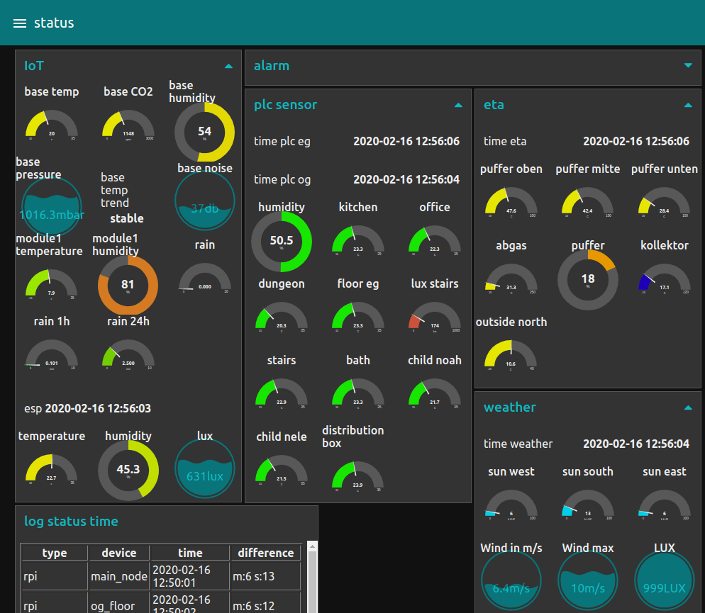
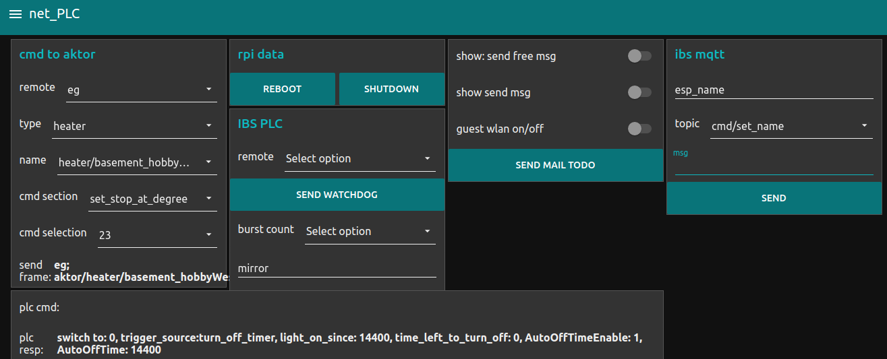
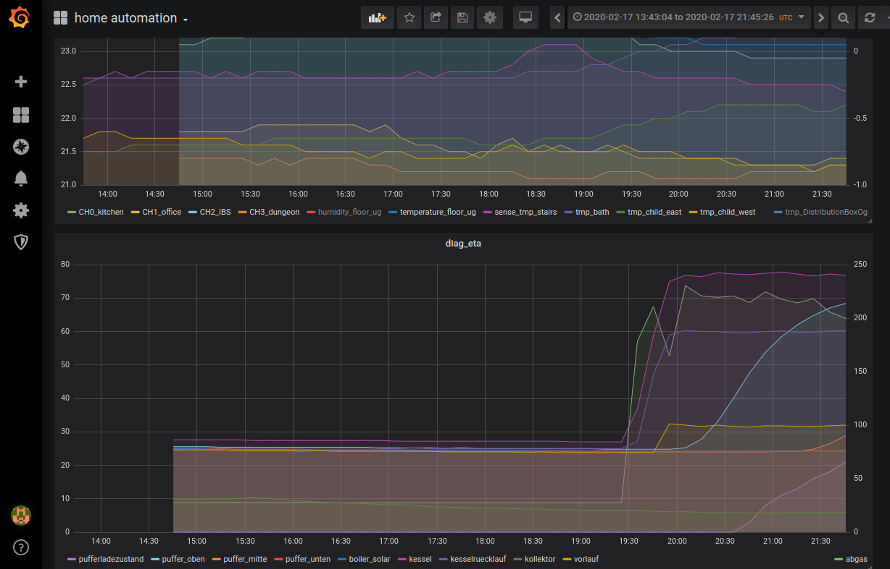
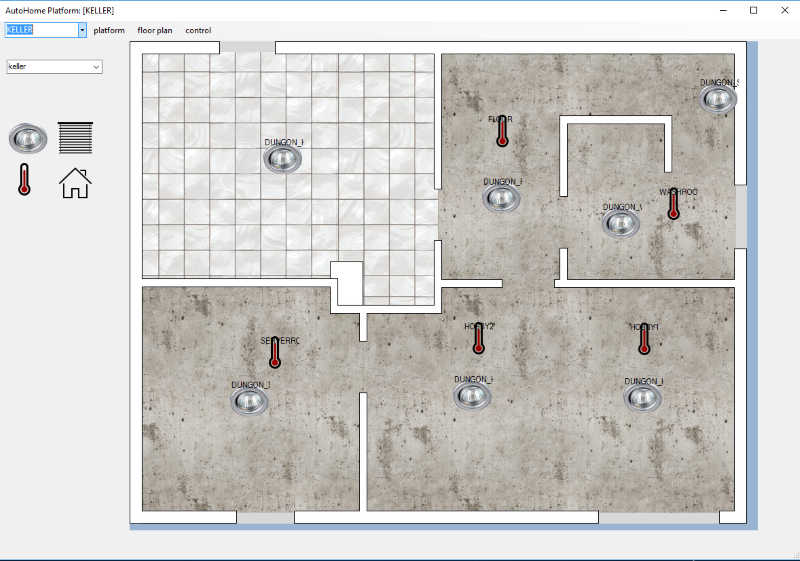
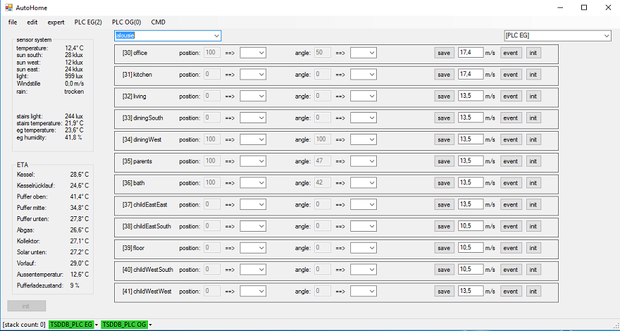
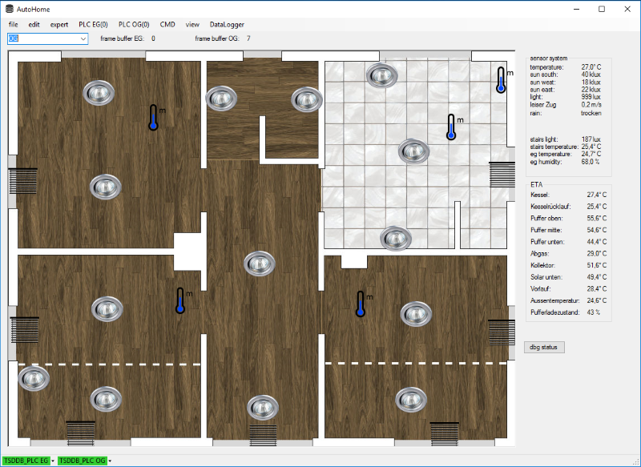
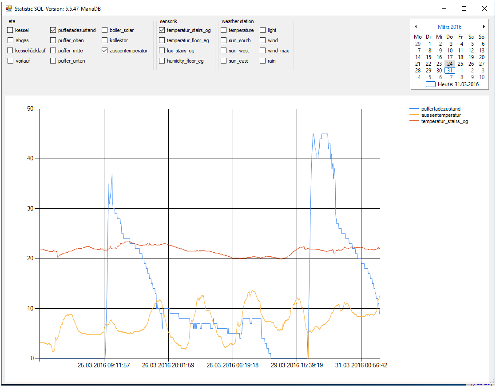

# Control system

## Node red

As control system and for the connection of other devices I currently use [node-RED](https://nodered.org).

***Node-RED is a programming tool for wiring together hardware devices, APIs and online services***

It has already implemented interfaces (which are called 'nodes') to a lot of devices I use.


### Requirements regarding plugins

1. node-red-dashboard
1. node-red-contrib-fritz
1. node-red-contrib-s7
1. node-red-node-mysql
1. node-red-contrib-os
1. node-red-contrib-mqtt-broker
1. node-red-node-email
1. (outdated) node-red-contrib-netatmo
1. node-red-contrib-netatmo-dashboard
1. node-red-contrib-viera

### Dashboards

It is easy to make quick dash boards to monitor the sensor and health state of the devices.



Or to configure debug / control clients for different devices



## Grafana

Using an open source solution is much easier than implementing a monitor dashboard yourself.

***Grafana is the open source analytics and monitoring solution for every database***

I had good experiences with [grafana](https://grafana.com). Out of the box even larger time ranges are displayed performant.

I can recommend this [installation pages](https://grafana.com/docs/installation/docker/)



## mqtt mosquitto

***Eclipse Mosquitto is an open source message broker that implements the MQTT protocol***

## Raspberry setup

Most of the control components are running as docker image on a raspberry.

Here are a few steps to set up:

* enable ssh server

* copy the puplic key to the raspberry for easier access

```bash
cat ~/.ssh/id_rsa.pub | ssh pi_name@192.168.xxx.xxx -p 22 'mkdir -p ~/.ssh && cat >> ~/.ssh/authorized_keys'
```

* get docker

```bash
`sudo apt-get update && sudo apt-get upgrade -y`
`curl -sSL https://get.docker.com | sh`
`sudo usermod -aG docker $USER`
```

* setup container **mqtt mosquitto**

```bash
docker run -itd -p 1883:1883 -p 9001:9001 --name mosquitto_ah eclipse-mosquitto
```

* setup container **node red**

Mind that as long as we run the mosquitto and node-red container at the same host the `--link mosquitto_ah:broker` is necessary.

If changing the deployment to different machines update the node-red-mqtt-server from broker to the new ip address

```bash
sudo chown -R 1000:1000 /home/pi/.node-red
docker run -it -p 1880:1880 -p 7724:7724/udp -p 7725:7725/udp -v /home/pi/.node-red:/data --restart=always --name nodered_ah --link mosquitto_ah:broker nodered/node-red
```

* setup container **grafana**

```bash
docker volume create grafana-storage
docker run -d -p 3000:3000 -v grafana-storage:/var/lib/grafana --name=grafana_ah grafana/grafana
```

* setup pi hole

The network ad blocking / monitoring software [pi-hole.net](https://pi-hole.net)

is not really connected to the home automation system but it is always a good idear to have control over your network.

## dotNet tool

The PC-Tool is written in C# and was developed during the commissioning phase (which will probably not be finished that soon ;-) ).

The tool has a fancy surface and is suitable for carrying out basic parameter settings on the controller.

It turns out that it is uncomfortable to rely on a windows pc to control the system.

If you are interested you can look at it [references.md](references.md)

Here are some historical pics of the outdated dot net pc tool.


All devices / sensors / actuators could be configured in a parameter window.

Due to its generic structure, any actuators can be added during runtime and addressed in the controller.

These can then be positioned in the ui by drag and drop



With this view all actors of a selected type can be observed and controlled



Clicking on a specific image either triggers an action or opens a sub window with further options




To visualize past data from the data logger the tool has a sql client with dashboard


