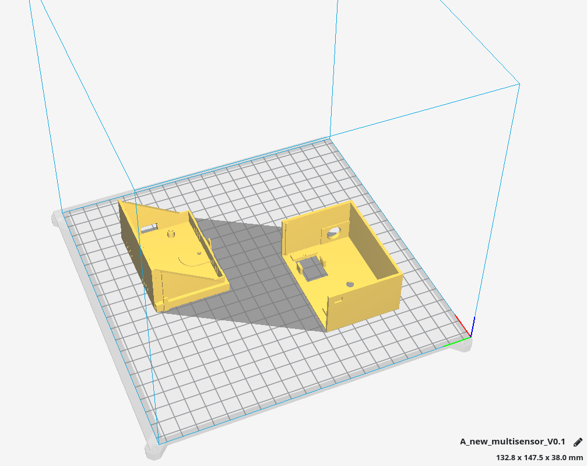

# Field level

## IoT multisensor

### ESP8266

To enable the esp8266 libs at Arduino IDE

* Go to File > Preferences -> Additional Board Manager URLs: http://arduino.esp8266.com/stable/package_esp8266com_index.json
* Tools > Board -> Boards Manager -> Search for ESP8266 and install

Dependency libs:

* git clone https://github.com/knolleary/pubsubclient.git

* git clone https://github.com/adafruit/DHT-sensor-library.git

* copy to ~/Arduino/libraries

Features:

* read temperatur / humility and publish cyclic

* read light lux and publish cyclic

* detect motion and publish at detection (on rising edge)

MQTT Interface

* subscription topics (start with prefix(iot/v01) + esp_name + topic_type)

* e.g. iot/v01/nodeMCUIBS/config/get_status

topic|meaning
-|-
/config/echo|just send an reply
/config/get_status[value: ""; status; prozess; heap]|
/config/set_name [new name]|change name of esp (with prefix for topics)
/config/send_intervall_sensor [new time in ms]|e.g. "10000" for 10s
/config/send_intervall_status|watchdog with status information
/config/reset [dht, setup, vars]|

GPIO usage

pin|DHT22|AM312|KY-018
-|-|-|-
1|VCC|VCC|GND
2|DATA=D7|OUT=D2/D5|VCC
3|nc|GND|DATA=A0
4|GND||

### 3D case

This is the 3D model of the case



### Downloads

You can download the STL file here: [new_multisensor_V0.1](iot_multisensor/new_multisensor_V0.1.stl)

The arduino sketch is stored here: [ah_iot_multisensor_v06](iot_multisensor/ah_iot_multisensor_v06.ino)

## Wetter station

For the weather station I decided for the P03/3-Modbus from Elsner.


With it I can get the weather data: Brightness (east, south and west sun), wind speed, temperature and precipitation.

With the Modbus variant I want to keep the possibility open to connect several participants (in special room sensors) to the control system via the bus system.

## The heating system

My heating consists of the 20qm solar collectors and the "romantic" stove in the living room as well as an ETA SH20 twin.


During the installation I saw that a maintenance interface is attached to the display.

On inquiry with the manufacturer I got the RS232 protocol and thus the possibility by a CM1241 to access it.

Here the protocoll:

1. Byte startsign: alwas ’{’ == hex 0x7B
2. Byte Servicekennung
3. Byte Servicekennung
4. Byte Anzahl der Nutzdatenbytes
5. Byte Prüfsumme: alle Nutzdatenbytes addiert, modulo 256
6. ab 6. Byte Nutzdaten

last Byte stoppsign alwas ’}’ == hex 0x7D

settings of serial interface:

19200 Baud, 1 Startbit, 8 Datenbits, 1 Stoppbit, NoParity, NoHandshake

Herewith I inform the heating control that it should send out the actual values cyclically:

```javascript
#SEND_PTP_start(REQ := #cmd.eta_start,
                "PORT" := #CP_Adress,
                BUFFER := #frame_start);
#cmd.eta_start := FALSE;

#SEND_PTP_cmd(REQ:=#cmd.eta_cmd,
              "PORT":=#CP_Adress,
              BUFFER:=#frame_cmd);
```
