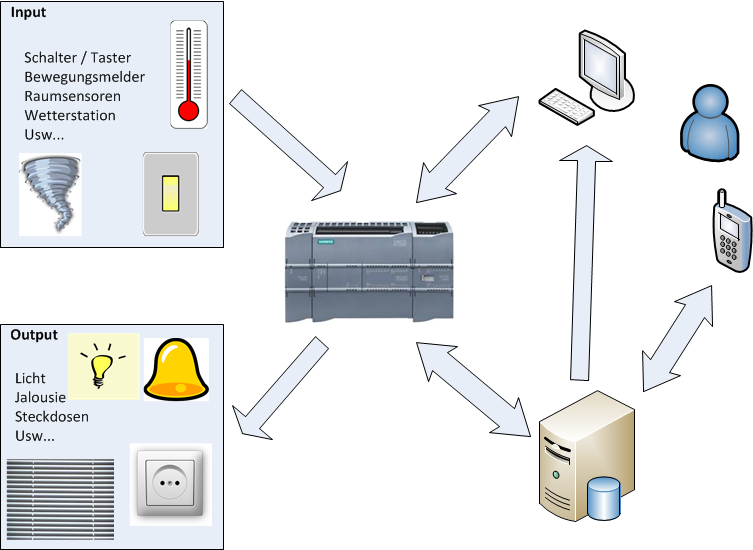

# another self-built home automation system

My main focus was a robust, self-sufficient control system with which I could not depend on a proprietary system from a single manufacturer but could expand with hardware / software from different manufacturers.

Here my choice fell on Simatic CPUs. The sensors and actuators are wired to these and they process the control program.

Via the LAN interface, the CPUs communicate with a NAS running a data logger script. Here various data are stored in a mySQL database for later evaluation.

As a central control system I use NodeRed which provides a webserver for operation (and a lot of help during development).

## Requirements

type | desc
-|-
robustnes|When switching on (e.g. after a power failure) the system itself should start up and be active
robustnes|Services / applications on servers should be monitored automatically and restarted if necessary
robustnes|Backups of databases and other artifacts should be created automatically.
interoperability|The different components of the system shall provide apis to exchange information and communicate with internal and external applications and systems.
interoperability|The system shall be open to different transport protocols and publishing / describing interfaces.
interoperability|For integrating iot devices the system provides shall provide a MQTT broker. That allows easy w-lan connecting of esp based devices
interoperability|The PLC shall communicate to sensors / actors hardwired, via modbus, analog voltage signals, ...
interoperability|The data formats, transport protocols and interfaces shall be derived from central managed masterdata

## Components

[source](images/readme_plantuml.md)

here another view of the main components

!!! warning

    of course I am not liable for any damage caused by replicas ;-)
