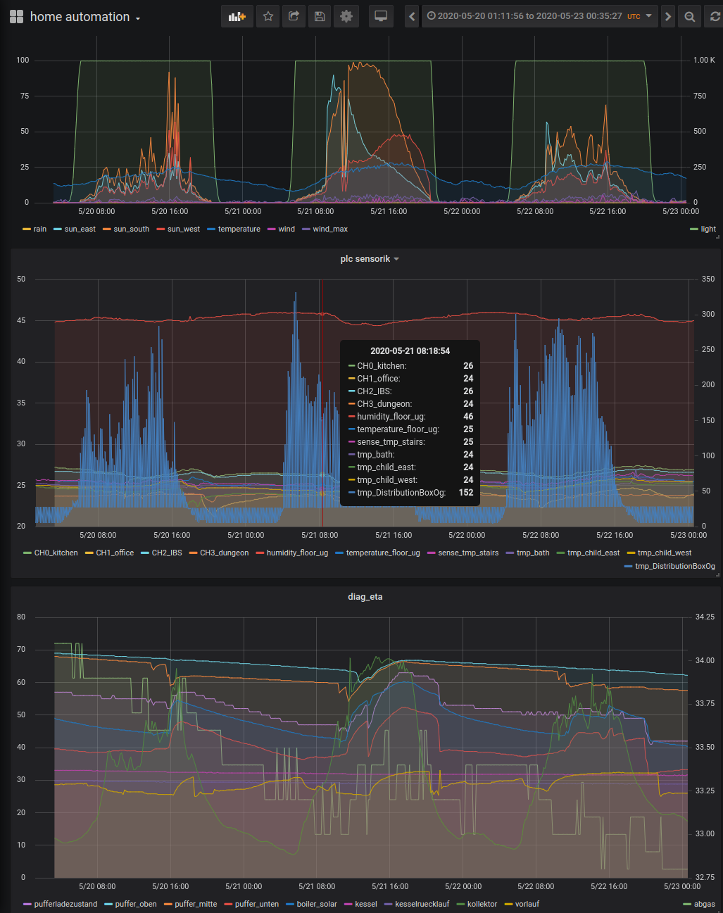

# Control system

## Grafana

Using an open source solution is much easier than implementing a monitor dashboard yourself.

***Grafana is the open source analytics and monitoring solution for every database***

I had good experiences with [grafana](https://grafana.com). Out of the box even larger time ranges are displayed performant.

I can recommend this [installation pages](https://grafana.com/docs/installation/docker/)

## mqtt mosquitto

***Eclipse Mosquitto is an open source message broker that implements the MQTT protocol***
