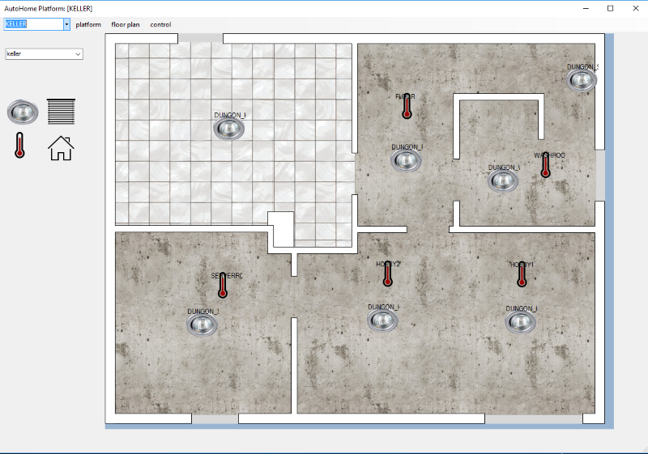
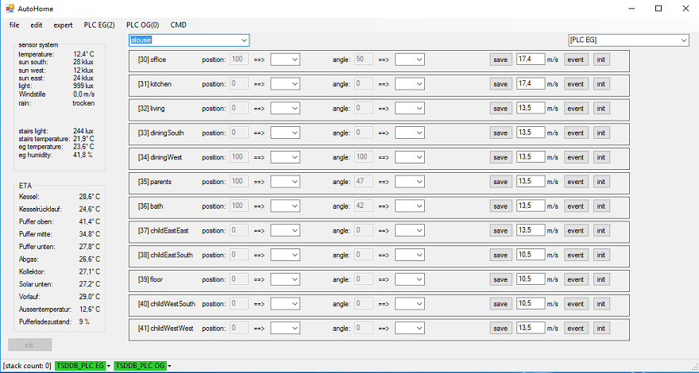

# PC tool for controlling / monitoring the system

The PC-Tool is written in C# and was developed during the commissioning phase (which will probably not be finished that soon ;-) ).

The tool has a fancy surface and is suitable for carrying out basic parameter settings on the controller.

It turns out that it is uncomfortable to rely on a windows pc to control the system.

If you are interested you can look at it [references.md](../references.md)

Here are some historical pics of the outdated dot net pc tool.

All devices / sensors / actuators could be configured in a parameter window.

Due to its generic structure, any actuators can be added during runtime and addressed in the controller.

These can then be positioned in the ui by drag and drop

With this view all actors of a selected type can be observed and controlled

Clicking on a specific image either triggers an action or opens a sub window with further options

To visualize past data from the data logger the tool has a sql client with dashboard

