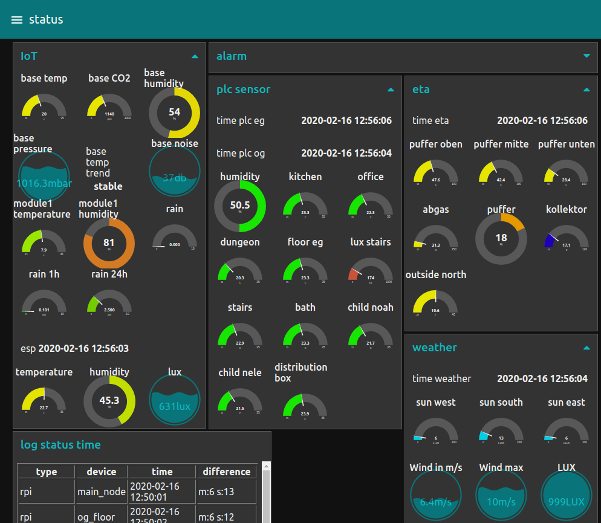

# Node red

As control system and for the connection of other devices I currently use [node-RED](https://nodered.org).

***Node-RED is a programming tool for wiring together hardware devices, APIs and online services***

It has already implemented interfaces (which are called 'nodes') to a lot of devices I use.

## Requirements regarding plugins

1. node-red-dashboard
1. node-red-contrib-fritz
1. node-red-contrib-s7
1. node-red-node-mysql
1. node-red-contrib-os
1. node-red-contrib-mqtt-broker
1. node-red-node-email
1. (outdated) node-red-contrib-netatmo
1. node-red-contrib-netatmo-dashboard
1. node-red-contrib-viera

## Dashboards

It is easy to make quick dash boards to monitor the sensor and health state of the devices.

Or to configure debug / control clients for different devices

