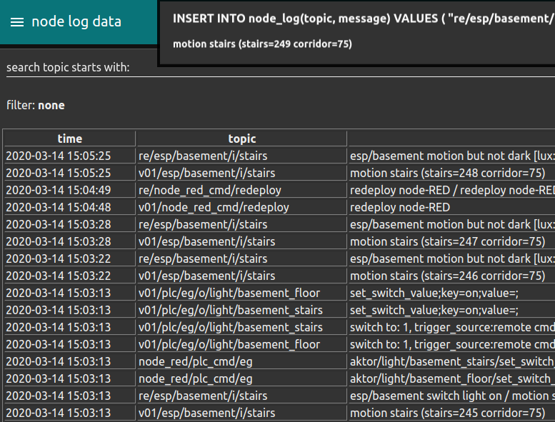

# Node red

As control system and for the connection of other devices I currently use [node-RED](https://nodered.org).

***Node-RED is a programming tool for wiring together hardware devices, APIs and online services***

It has already implemented interfaces (which are called 'nodes') to a lot of devices I use.


## Dashboards

It is easy to make quick dash boards to monitor the sensor and health state of the devices.


Or to configure debug / control clients for different devices


## Rule engine

The rule engine is a function node that is triggered by the receipt of any message.


In this example rule a sensor event from the light barrier triggers the rule engine.

If the weather station detects that it is dark two lights are switched on.

```javascript
var plc_cmd = [];
var alarm_info = 'not_processed';

if(t.startsWith('v01/esp/basement/i/')){
    let lux = global.get('PD.esp_basement.lux');
    let switch_value = 150
    if(lux<switch_value){
        alarm_info = 'esp/basement switch light on'
        plc_cmd.push({ payload: "aktor/light/basement_floor/set_switch_value#on", topic: "eg" });
        plc_cmd.push({ payload: "aktor/light/basement_stairs/set_switch_value#on", topic: "eg" });
    }else{
        alarm_info = 'esp/basement motion but not dark [lux: ' + lux + '] > ' + switch_value;
    }
}

// for logging or later use a new alarm is generated
// and stored at the database
if(alarm_info !== 'not_processed'){
    msg.alarm = {
        topic : t,
        payload : p,
        status : 'created',
        time_created : getFormattedDate(),
        info : alarm_info
    }
    let ret = t.replace('v01','re');

    // the alarm and commands for the PLC s are returned for further processing
    msg.topic = "INSERT INTO node_log(topic, message) VALUES ( \"" + ret +"\", \""+ alarm_info + " / " + p + "\" )"
    return [msg, plc_cmd];
}
```

Here are the log messages when the motion sensor is triggered



## some hints

Initialising Variable

```javascript
var count=context.get('count') || 0;
var count2=context.get('count2') || 0;

// You can also use an object e.g
var local=context.get('data') || {};
if (local.count===undefined) //test exists
{
  local.count=0;
}
```

## my config

## Imported Nodes (Plugins)

name|usage
-|-
node-red-dashboard|frontend dashboard elements
node-red-contrib-fritz|get network device status / control guest wlan
node-red-contrib-s7|connection to PLCs via S7 protocol, almost no longer in use (replaced by the udp protocol)
node-red-node-mysql|reading / writing to maria database
node-red-contrib-os|access to operating system bevore switching to docker
node-red-contrib-mqtt-broker|mqtt client
node-red-node-email|send alarm / notification e-mails
node-red-contrib-netatmo|todo check if outdated
node-red-contrib-netatmo-dashboard|getting netatmo weather station data from cloud-account
node-red-contrib-viera|control the Panasonic TV

## Downloads

If you are interested in the flows you can find the download link at the references.
