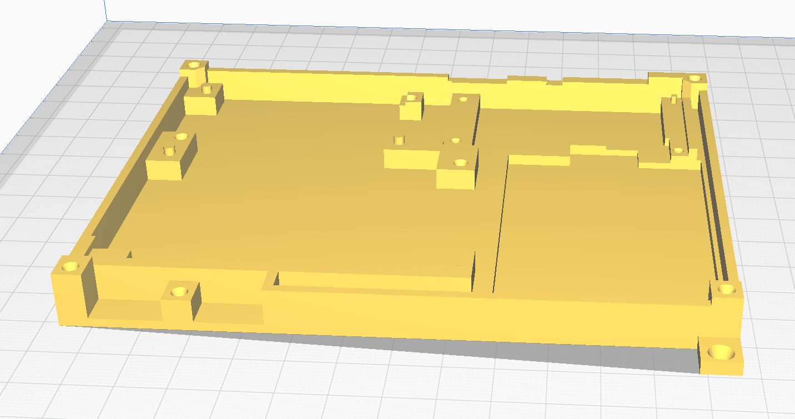
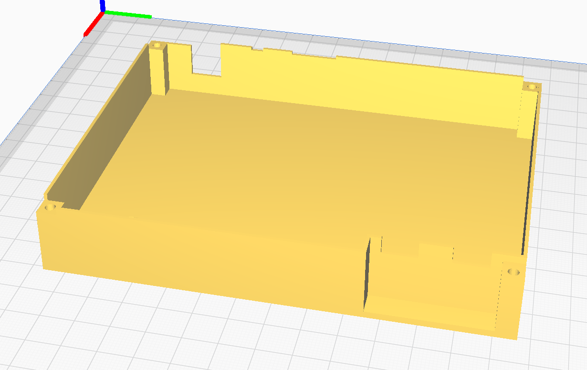

# ESP cat scare

## The idea

Unfortunately, our carport is regularly abused as a cat toilet. This is to be turned off with an ultrasonic sound.

This device is a combination of the IoT multisensor and the light control component.

It consists of three pir sensors and a relay board which controls an ultrasonic generator. With this mini piezo tweeters are driven.

## Parts list

component|name|manufacturer
-|-|-
4-relais||az-delivery
node-mcu|az-delivery
PIR|AM312|
tweeter|P5123|Kemo
ultrasonic-generator|M048N|Kemo
12V power supply||
step down converter 12V -> 5V|MP1584EN|

## Pinout

## wiring

## Case

The bottom

and the top

