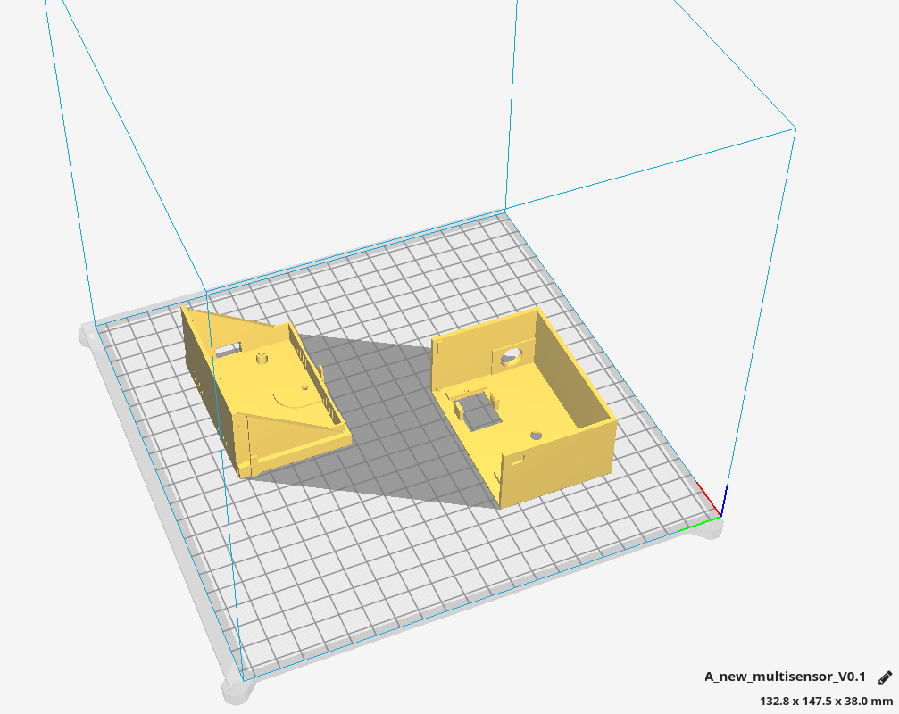

# IoT multisensor

## Install Arduino IDE

The Arduino IDE from the package repository is very old.

To install Arduino IDE from the [Official Website](https://www.arduino.cc/en/Main/software) download your package.

```bash
cd ./Downloads
sudo tar xvJf arduino-1.8.12-linux64.tar.xz -C /opt
ls -lh /opt/
sudo -E /opt/arduino-1.8.12/install.sh
```

Now, you have to add the Debian 10 login user to the dialout, tty, uucp and plugdev group.
[https://linuxhint.com/install_arduino_ide_debian_10/](https://linuxhint.com/install_arduino_ide_debian_10/)

## ESP8266

To enable the esp8266 libs at Arduino IDE

* Go to File > Preferences -> Additional Board Manager URLs: http://arduino.esp8266.com/stable/package_esp8266com_index.json
* Tools > Board -> Boards Manager -> Search for ESP8266 and install

Dependency libs:

* git clone https://github.com/knolleary/pubsubclient.git

* git clone https://github.com/adafruit/DHT-sensor-library.git

* copy to ~/Arduino/libraries

Features:

* read temperatur / humility and publish cyclic

* read light lux and publish cyclic

* detect motion and publish at detection (on rising edge)

MQTT Interface

* subscription topics (start with prefix(iot/v01) + esp_name + topic_type)

* e.g. iot/v01/nodeMCUIBS/config/get_status

topic|meaning
-|-
/config/echo|just send an reply
/config/get_status[value: ""; status; prozess; heap]|
/config/set_name [new name]|change name of esp (with prefix for topics)
/config/send_intervall_sensor [new time in ms]|e.g. "10000" for 10s
/config/send_intervall_status|watchdog with status information
/config/reset [dht, setup, vars]|

## NodeMCU GPIO

[node gpio pinout](https://www.instructables.com/id/NodeMCU-ESP8266-Details-and-Pinout/)

digitalWrite did NOT work with GPIOs 6, 7, 8, 11, and ADC (A0)

digitalRead did NOT work with GPIOs 1, 3, 6, 7, 8, 11, and the ADC (A0)

### GPIO sensoric

pin|DHT22|AM312|KY-018
-|-|-|-
1|VCC|VCC|GND
2|DATA=D7|OUT=D2/D5|VCC
3|nc|GND|DATA=A0
4|GND||

### NODE mcu platine soldered

GPIO|platine-color|device
-|-|-
D2|orange|pir 1 -> pin_2 (stairs)
D5|yellow|pir 2 -> pin_2 (corridor)
3V|red|pir1/2 -> pin_1
3V|violett|pir1/2 -> pin_1
gnd|blue|pir1/2 -> pin_3
gnd|grey|pir1/2 -> pin_3
A0|green|S
g|yellow|middle
VV|orange|-
D7|grey|DHT_2
3V|black|DHT_1
g|white|DHT_4

### NODE mcu general

GPIO|device|GPIO|device
-|-|-|-
A0|KY-S [black]|D0|
G|KY-middle [brown]|D1|
VV|KY - [red] |D2|pir middle [orange]
S3||D3|
S2||D4|
S1||3V|
SC||G|
S0||D5|pir middle [yellow]
SK||D6|
G|pir 3 [red/grey]|D7|DHT22 2 (signal) [orange]
3V|pir 1 [blue/green]|D8|
EN||RX|
RST||TX|
G||G|DHT22 4 [red]
VIN||3V|DHT22 1 [brown]
-|===|===|-

## 3D case

This is the 3D model of the case



## Downloads

You can download the STL file here: [new_multisensor_V0.1](new_multisensor_V0.1.stl)

The arduino sketch is stored here: [ah_iot_multisensor_v06](ah_iot_multisensor_v06.ino)