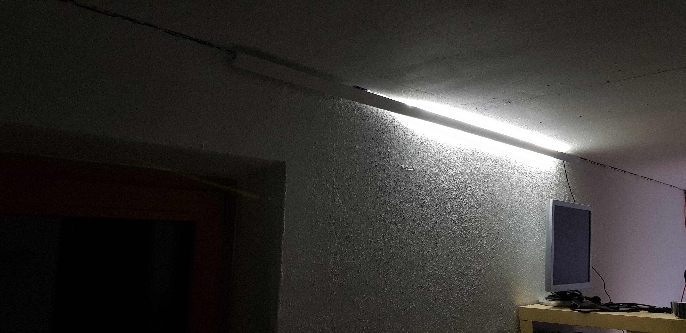
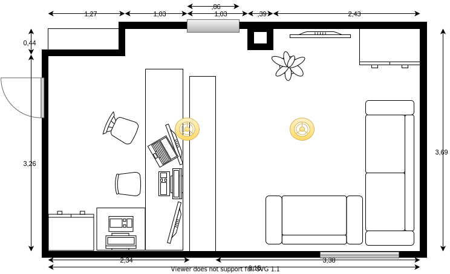

# light control in basement office/living room

## The idea

Install indirect lighting in a large basement room.

The room is divided into two areas: Office and living area.

## Components

* Paulmann Duo Profil 2m (70267)

* Self-printed corner profile holder

* NodeMCU as mqtt gateway

* 4x Relais to controll the power supplys

## The first prototype

To find out what it might look like and check if the `self-printed corner profile holders` work.

## Room with dimensions

## Room with LED planning

### Length calculation LED-stripes

Distance profile to wall ~2cm

* **Office** ceiling/white

(2,65 - 0,04) x 2 = **5,22** / (3,69 - 0,04) x 2 = **7,3** / 4 x 0,66 = **2,64**

5,22m + 7,3m + 2,64m = **15,16m**

* **Office** wall/blue

(2,65 - 0,04) x 2 = **5,22** / 3,69 - 0,04 = **3,65** / 4 x 0,66 = **2,64**

5,22m + 3,65m + 2,64m = **11,51m**

* **Living-room** ceiling/white

(3,5 - 0,04) x 2 = **6,92** / (3,69 - 0,04) x 2 = **7,3** / 2 x 0,66 = **1,32**

6,92m + 7,3m + 1,32m = **15,54m**

* **Living-room** wall/blue

(3,5 - 0,04) x 2 = **6,92** / 3,69 - 0,04 = **3,65** / 2 x 0,66 = **1,32**

6,92m + 3,65m + 1,32m = **11,89m**

### Length calculation power

The longest supply line is about 6 meters.

Since there are long distances we use 24V.

Assumption the living-room white leds have 9,6 watt per meter: 9,6w/m * 16m = ~150 watt total.

The power supply is divided between two cables = ~75 watt + about 20% reserve = ~90 watt.

With cable cross section 0,75mm² leads to ~5% voltage drop (which is ok).

about 16 + 28 = 44m 0,75mm²

### Summary

Area|Direction|Length LED|Length\npower
-|-|-|-
Office|wall/blue|11,51m|2x4
Office|ceiling/white|15,16m|2x4
Living-room|wall/blue|11,89m|2x7m
Living-room|ceiling/white|15,54m|2x7m
