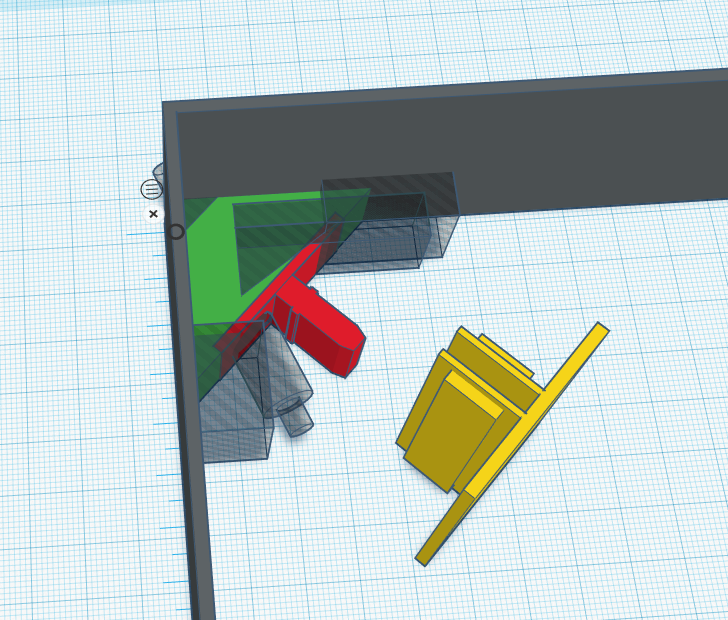
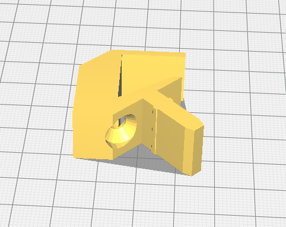
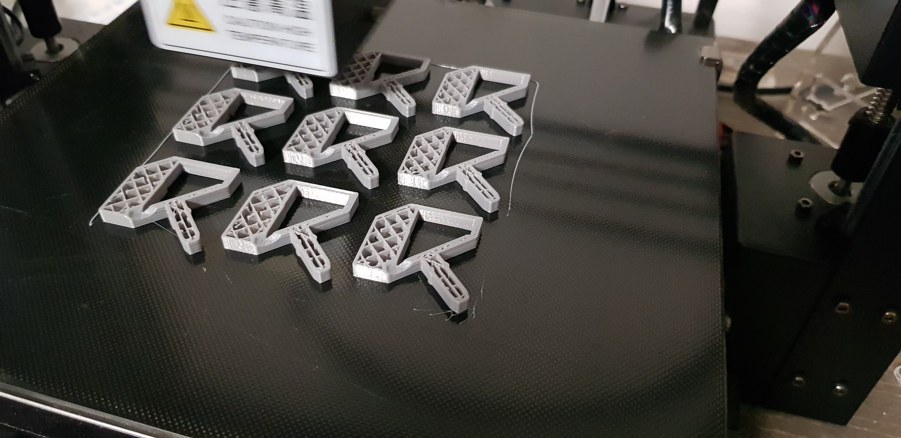
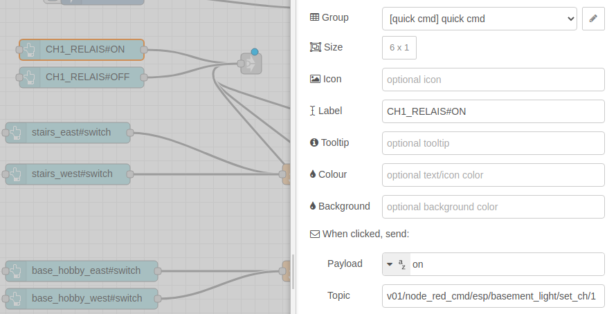

# Light control office/wellness-area

## The idea

Install indirect lighting in a large basement room.


The room is divided into a working and a wellness-area.

Each area should be indirectly illuminated in the wall/ceiling corners through led stripes.

## Components

* Paulmann Duo Profil 2m (70267)

* Self-printed corner profile holder

* NodeMCU as mqtt gateway

* 4x 5V relays to controll the power supplys

* 4x 24V LED power supply

* LED Stripes white, warm white, and blue

* Cabel 2x0,75mm²

## The first prototype

To find out what it might look like and check if the `self-printed corner profile holders` work.


## Room with LED planning

* The ceiling of both areas should be illuminated with neutral white light

* In the wellness area the walls should be illuminated with a warm white light

* and in the office the wall light should be blue

* Vertical lighting is installed in selected corners and passages


### Led Stripe

For the ceiling I have selected a Stripe with white and warm-white LEDs:

* 240 SMD LEDs / meter

* Chipsatz 2216

* Power per meter: 19,2 Watt (7,9 W / Chip)

* Light flux: 1680 Lumen/m

### Length calculation LED-stripes

Distance profile to wall ~2cm

Led stripe separable every 5cm

Area|calculation|Alu profile
-|-|-
Office ceiling_up|5,22m + 7,3m |12,52m
Office ceiling_down|5,22m + 3,65m |8,87m
wellness-area ceiling_up|6,92m + 7,3m + 1,32m|14,22m
wellness-area ceiling_down|6,92m + 3,65m + 1,32m|10,57
both wall|0,65m x 6|4m

### Length calculation power

The longest supply line is about 6,5 meters.

In total (16m office + 28m wellness-area about  = 44m


Since there are long distances we use 24V.

Assumption the wellness-area white leds have 19,2 watt per meter: 19,2w * 15m = ~300 watt total.

The power supply is divided between two cables = ~150 watt.

With a cable cross section of 1.00mm² this leads to ~5% voltage drop (which is okay).

### Power supply

* Power per meter: 19,2 Watt (for ceiling_up and wall)

* Wall Stripe = 65cm ~12,5 Watt

Area|Direction|Length LED|Length cable|Watt|Ampere
-|-|-|-|-|-
Office|ceiling_up|12,5m|2x4m|240w|10
Office|ceiling_down|8,85m|2x4m|(170w)
wellness-area|ceiling_up|14,2m|2x7m|273w|11,34
wellness-area|ceiling_down|10,5m|2x7m|(201w)
both-areas|wall|7,8||150w|6,25

## Component corner profile holder

To design the aluminium profile mounting I used `tinkercad`.

It is for free, runs in browser and is easy to use.



Requirements:

* Compatible with Paulmann Duo Profil 2m (70267)

* Fits for Plasterboard screws 3.9 X 45mm

* Should act as cable fixation

If you want to download the stl file [klick here](https://github.com/alexkratzer/autohomestack/tree/master/stl_print)



Now the slicing. There I used `Ultimaker Cura` with the following parameters:

* Infill Density:           40%
* Printing Temperature:     200C
* Build Plate Temperature:  60C
* Print Speed:              60mm/s
* Support:                  No

The series production has started.



## Component Node MCU

As basis for the sketch I used the iot_multisensor.

The biggest difference is that the `light control` also controls outputs.

### Hardware settings

```c
const int RELAYS1 = D2;
const int RELAYS2 = D3;
const int RELAYS3 = D8;
const int RELAYS4 = D7;
```

```c
void setup_sensor(){
  pinMode(RELAYS1, OUTPUT);
  ...
  digitalWrite(RELAYS1, HIGH);
  ...
}
```

Now we can control the relays with the `digitalWrite()` function.

```c
// activate
digitalWrite(RELAYS1, LOW)
// and to disable again
digitalWrite(RELAYS1, HIGH)
```

### Pinout

NodeMCU

GPIO|device|GPIO|device
-|-|-|-
A0||D0|
G||D1|
VV|[red] 5V out |D2|[green] CH1
S3|             |D3|[orange] CH2
S2||D4|
S1||3V|
SC||G|[blue] GND
S0||D5|
SK||D6|
G||D7|[brown] CH4
3V||D8|[yellow] CH3
EN||RX|
RST||TX|
G||G|
VIN||3V|
-|===|===|-

4-Relais Modul 5V

GND|IN1|IN2|IN3|IN4|VCC
-|-|-|-|-|-
blue|green|orange|yellow|brown|red

### MQTT interface

To control the relays from remote we use a new `/set_ch/` endpoint.

`v01/esp/basement_light/set_ch/` + `<RELAYS>`

```c
void setDefaultTopics(){
  topic_sub_set_ch =      default_prefix + esp_name + "/set_ch/#";
}

client.subscribe(topic_sub_set_ch.c_str());
```

The callback function gets expanded

```javascript
void mqtt_callback(char* topic, byte* payload, unsigned int length) {
    String topic_set_ch = default_prefix + esp_name + "/set_ch/";

    if(t == topic_set_ch + "1"){
        set_ch(t, (char*)payload);
    }
}

void set_ch(String t, String p){
  if (p == "on") {digitalWrite(RELAYS1, LOW); sendResponse("set_ch1: on"); }
  else if (p == "off") {digitalWrite(RELAYS1, HIGH); sendResponse("set_ch1: off");}
  else sendResponse("set_out ERROR: " + p);
}
```

## Set RELAYS from NodeRed

Internaly at NodeRed the following topic is used:

`v01/node_red_cmd/esp/<ESP_NAME>/set_ch/<RELAYS>`

* ESP_NAME example: control_light
* RELAYS: 1, 2, 3, 4

Payload: on, off, switch

This code is added to the `rule engine` function

```javascript

if(t.startsWith('v01/node_red_cmd')){
    ...
    if(t.startsWith('v01/node_red_cmd/esp/set_ch')){
        mqtt_msg.push({ topic: t.replace("/node_red_cmd", ""), payload: p });
    }
    ...
}
```

Now the relays can be set by this mqtt message:

* topic `v01/node_red_cmd/esp/basement_light/set_ch/1`

* payload `off` or `on`


