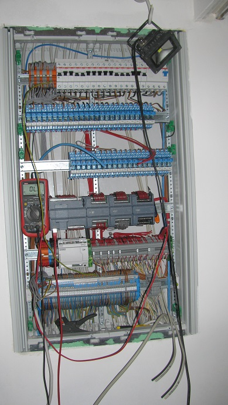

# plc

For monitoring and control of most hard-wired sensor/actuator devices I use Siemens Simatic Series 1200 CPUs.

These are actually used in industrial environments (so they meet my requirements regarding robustness) and were priced within my budget.

The picture shows a sub-distributor during the construction phase. Right beside the multimeter you can see a 1214C CPU with 3x DI/DO expansion modules.

The CPUs are programmed with SCL (Structured Control Language). The syntax is similar to Pascal. In the following I describe the user program in excerpts.
