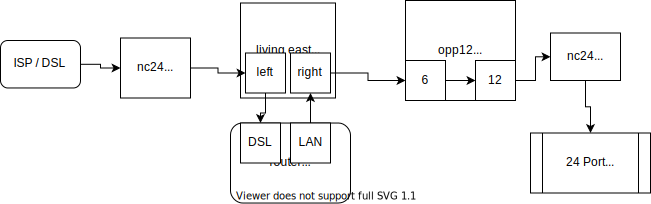

# Network wiring plan

## Legend

Short|Floor|Place|Description
-|-|-|-
**nc24**|basement|network cabinet|server room 24 ports
**nsg**|ground|network socket ground floor|connection sockets
**opp12**|ground|office patch panel|12 ports
**plc_g**|ground|plc box ground floor|2 ports
**nsu**|upper|network socket upper floor|connection sockets
**plc_u**|upper|plc box upper floor|2 ports
**upp?**|upper|upper floor patch panel|not yet installed
**plc_car**|outside|plc box carport|2 ports

* * *

## Network cabinet 24 port (nc24)

The main patch-panel located in the basement network cabinet

### nc24 remote ground floor

Port|Place ground floor|Remote station|comment
-|-|-|-
1|office 1|TODO: ????|TODO: ????
2|plc_g|PLC ground floor|used port
n/a|reserved|-
4|nsg|living/dining south|right
5|opp12|office patch panel/Port 11|
6|nsg|living east|left
7|kitchen north|no can yet|not checked
8|office 2|TODO: ????|TODO: ????
9|nsg|kitchen west right|error pin 3/6
10|opp12|office patch panel/Port 12|bridge router DSL
n/a|reserved|-
n/a|reserved|-
??|plc_g|PLC ground floor reserve/unhooked|not checked

* * *

### nc24 remote upper floor

Port|Place upper floor|Remote station|comment
-|-|-|-
13|plc_u|PLC upper floor|
n/a|reserved|-
n/a|reserved|-
16|nsu|child-east wall|IP-cam
17|nsu|parents east|right
18|upp?|TODO: ????
19|nsu|child-west east|right
n/a|reserved|-
21|nsu|child-east west|right
22|plc_car|PLC carport|
n/a|reserved|-
n/a|reserved|-

* * *

## Office patch panel (opp12)

Office ground floor 12 port patch panel with switch

bridge router DSL port 6 <-> 12

Port|Remote station|Place|Port
-|-|-|-
1|nsg|office east-south|left
2|nsg|office east-south|right
3|nsg|office east-north|right
4|nsg|office west|right
5|nsg|office south|right
6|nsg|living east|right
7|nsg|living south-east|right
8|nsg|living south-east|left
9|nsg|office south|left
10|nsg|living south-middle|left
11|nc24|Network cabinet 24 port|Port 5
12|nc24|Network cabinet 24 port|Port 10

not applicable / unhooked

* kitchen west left
* kitchen north
* office west left
* office east-north left

## Upper floor patch panel (upp?)

not yet installed

* * *

## Network socket

### Ground floor (nsg)

Room|Place|Port|Remote/Port
-|-|-|-
office|east-north|left|unhooked
office|east-north|right|opp12/3
office|east-south|left|opp12/1
office|east-south|right|opp12/2
office|south|left|opp12/9
office|south|right|opp12/5
office|west|left|unhooked
office|west|right|opp12/4
living|east|left|nc24/6
living|east|right|opp12/6
living|south-east|left|opp12/8
living|south-east|right|opp12/7
living/dining|south|left|opp12/10
living/dining|south|right|nc24/4
kitchen|west|left|opp12 unhooked
kitchen|west|right|nc24/9
kitchen|north|left|unhooked
kitchen|north|right|unhooked
pantry|plc-box|1|nc24/2
pantry|plc-box|reserve|nc24/10

### Upper floor (nsu)

Room|Place|Port|Remote
-|-|-|-
bath|south|left|-
bath|south|right|-
child-east|west|left|-
child-east|west|right|nc24/21
child-east|north|left|-
child-east|north|right|-
child-east|wall|IP-cam|nc24/16
child-west|east|left|-
child-west|east|right|nc24/19
child-west|north|left|-
child-west|north|right|-
parents|east|left|-
parents|east|right|nc24/17
parents|west|left|-
parents|west|right|-
child-east|plc-box|1|nc24/13
child-east|plc-box|reserve|??

## current DSL connection

To avoid an additional wlan repeater, the DSL router is located on the ground floor.

