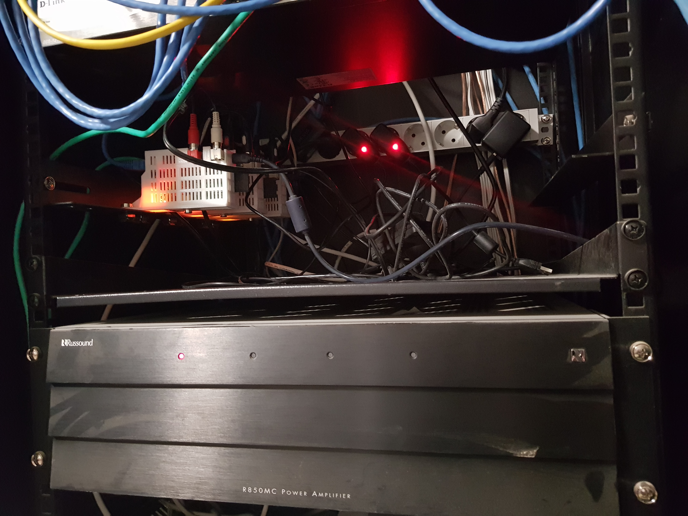

# The multiroom setup

For my multiroom system I used Raspberry PI's, a Russound amplifier and Dali speakers.

As "remote control" should work every device (PC/Tablet/Smartphone) with a UPNP client/App.

In my central solution I have laid all the speaker cables from the different rooms to the network cabinet.

With later implementation, a decentralized solution would also be possible.

In case of LAN and power supply the Raspberry and the amplifier could disappear in the wall/ceiling next to the speaker.

Here you see the network cabinet with tree raspberrys as media-player and the amplifier.

## Media-player

As in (almost) every modern household, no Raspberry PI should be missing.

On the Raspberry there is a digital/analog converter from [hifiberry.com](https://www.hifiberry.com/dac) plugged in, which feeds its signal into the amplifier.

As media player software I use **piCorePlayer** which is a tiny core linux distribution running entirely in RAM.

## Amplifier

After a long time of informing myself I ordered a refurbished Russound M850MC 8-channel amplifier from America via e-bay.

***R850MC_connections***

With its 19-inch format, it fits perfectly into the network cabinet and supplies the entire house in its current configuration.

The living room and the kitchen are controlled in parallel via a single Raspberry.

## Speaker

For the loudspeakers (built-in speakers in plaster cardboard) I chose the PHANTOM series of the company Dali.

In the living room I installed the IKON in the bathroom ceiling the PHANTOM-E-60 and in the hallway the PHANTOM-H-50.

In the kitchen there was little space in the wall and so the wall unit was the perfect place to put the compact box ZENSOR-3 on it.

## Synology server

hosting the Logitech Media Server LMS
