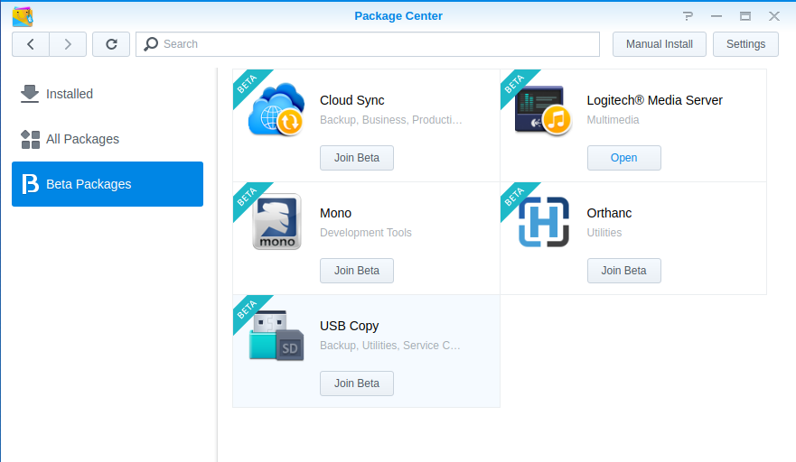
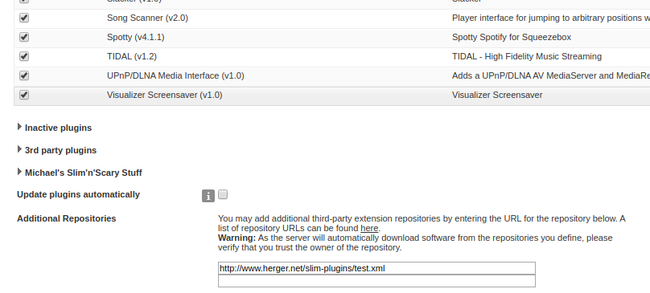
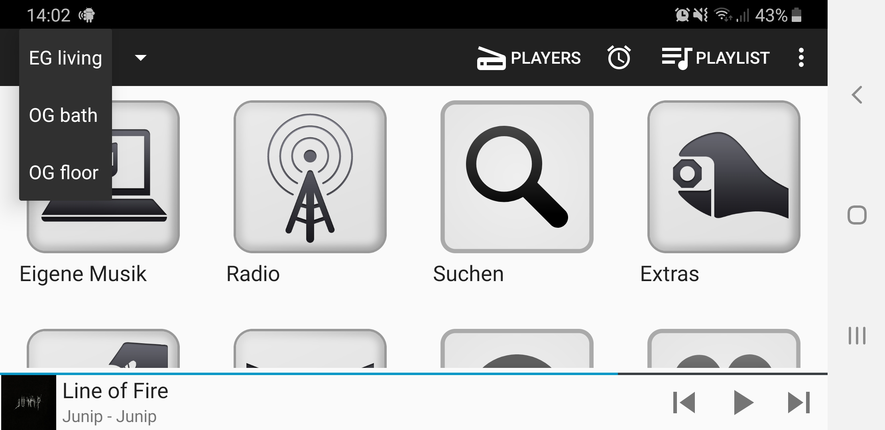
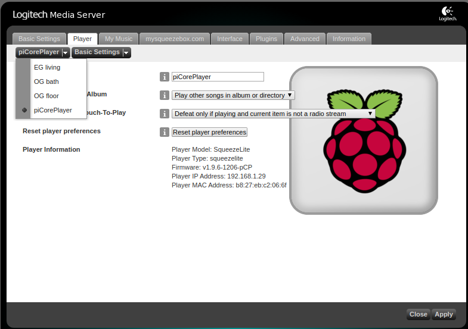

# My multiroom setup

My main requirements for the audio system were:

* Listen to music all over the house (and synchronize the rooms if desired)

* Listening from my own music collection (local stored at synology NAS)

* Listening from internet radio stations

* Support of my Spotify account

* Control the system from different devices (PC, Smartphone, Tablet)

After some research I came across the concept of multiroom

!!! multiroom-meaning

    Digital multi-room systems offer advantages over conventional stereo systems in terms of operation and versatility. 
    
    By using a NAS as data storage, changing CDs is no longer necessary and constant availability of the entire music library is guaranteed. 
    
    In addition, the systems often provide access to Internet radio stations and allow access to online music services.

## Concept

My multiroom concept is based on Squeezebox.

The system was originally developed by the company SlimDevices, but was discontinued after Logitech bought it and than released as open source software.

The devices developed at that time are unfortunately only available on the second-hand market today.

## Components

For my initial, central-wired multiroom system I used:

* Synology NAS as server
* Raspberry PI's as clients
* a Russound amplifier and
* Dali speakers.

As "remote control" should work every device (PC/Tablet/Smartphone) with a UPNP client/App.

In my central solution I have laid all the speaker cables from the different rooms to the network cabinet.

With later implementation, a decentralized solution would also be possible.

In case of LAN and power supply the Raspberry and the amplifier could disappear in the wall/ceiling next to the speaker.

Here you see the network cabinet with three raspberrys as media-player and the amplifier.

## Logitech Media Server

As media server I am using the Logitech Media Server ***LMS*** which is provided by the Synology DSM as Package.

For the connection to Spottify I use a plugin which requires LSM version > 7.9. This is currently (May 2020) only available as a beta package in DSM.

Follow this instructions [forums.slimdevices.com](https://forums.slimdevices.com/showthread.php?107418-The-Spotty-Spotify-implementation) to setup the Spotty Plugin.

At the LMS `Settings` go to tab `Plugins` and add `Additional Repositories`: [http://www.herger.net/slim-plugins/test.xml](http://www.herger.net/slim-plugins/test.xml)

## Media-player

As in (almost) every modern household, no Raspberry PI should be missing.

On the Raspberry there is a digital/analog converter from [hifiberry.com](https://www.hifiberry.com/dac) plugged in, which feeds its signal into the amplifier.

As media player software I use **piCorePlayer** which is a tiny core linux distribution running entirely in RAM.

For remote controll for the Logitech Media Server I use the app squeezer.

In the app I can select in which zone the music is played

And I can manage the playlist and synchronize the players if necessary

## Setup piCorePlayer

* [Download](https://www.picoreplayer.org/main_downloads.shtml) your image

* Unzip the image

* Burn onto SD card [How-to](https://www.picoreplayer.org/how_to_burn_pcp_onto_a_sd_card.shtml)

* Change the default name via the LMS website to avoid confusion

## Amplifier

After a long time of informing myself I ordered a refurbished Russound M850MC 8-channel amplifier from America via e-bay.

***R850MC_connections***

With its 19-inch format, it fits perfectly into the network cabinet and supplies the entire house in its current configuration.

The living room and the kitchen are controlled in parallel via a single Raspberry.

## Speaker

For the loudspeakers (built-in speakers in plaster cardboard) I chose the PHANTOM series of the company Dali.

In the living room I installed the IKON in the bathroom ceiling the PHANTOM-E-60 and in the hallway the PHANTOM-H-50.

In the kitchen there was little space in the wall and so the wall unit was the perfect place to put the compact box ZENSOR-3 on it.
