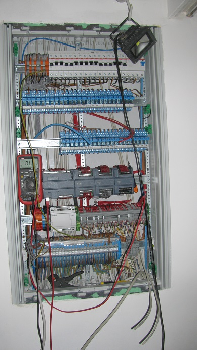
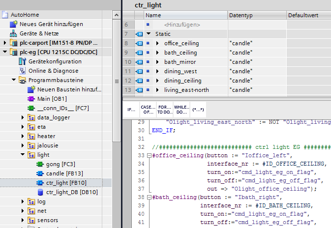

# Processing level

The core components of my home automation solution consist of Siemens Simatic 1200 series CPUs. These are actually used in industrial environments (so they meet my requirements regarding robustness) and were priced within my budget.

The picture shows a sub-distributor during the construction phase. Right beside the multimeter you can see a 1214C CPU with 3x DI/DO expansion modules.



The CPUs are programmed with SCL (Structured Control Language). The syntax is similar to Pascal. In the following I describe the user program in excerpts.

## Simatic PLC programm

### aktor interface

My focus was on a generic solution in order to be able to extend the control program easily or to port it to another environment without major adaptations.

For each actuator type (light, jalouse, socket, heating) there is a general function module that is instantiated for each device.



Here is an example of the light building block. This is called several times in a superimposed "control" block.

***ash became light***

```javascript
IF #turn_on THEN
    #switch_signal := true;
END_IF;

#Tturn_off(IN:=#turn_off, PT:=t#5s, Q=>#tmp_turn_off_hold);

IF #param."auto-off_lux_enable" THEN
    #"Tauto-off-lux"(IN := "sense_lux_stairs_og" > #param."auto-off_lux",
                    PT := t#10s,
                    Q => #tmp_turn_off_lux
    );
END_IF;
```

Since the interior of the house took place over the winter, I realized the light building block first.

The module has one input to change the output signal and one input to switch it on and one input to switch it off.

The output switches directly the coupling relay which controls the physical light.

In the "inner life" of the module there is a delay to prevent the rear switching on/off (I implemented this function because of a stress test of my kids). 

In addition there is a timer which switches off the light after a configured time and the possibility to also switch off the light if a brightness value is exceeded.

***and getting dark again***

The blind building block was a little trickier. Because I can't evaluate the signal of the physical end stop in the control I measured the time of the up and down movement.

The target position and the target angle of the slats (each in 0 - 100%) are transferred to an extra "blind motor" module.

In this module, the time of the actual position and the actual angle is continuously normalized and the target values are approached in a state machine. 

In addition, I have locked a simultaneous up and down signal at the outputs at different positions.

```javascript
// normierung der position/zeit zwischen 0 - 100 
#cur_data.position := REAL_TO_INT(NORM_X(MIN := 0, VALUE := #cur_data.position_in_time, MAX := #DRIVING_TIME_POSITION) * #DIGIT_SCALA);
#cur_data.angle := REAL_TO_INT(NORM_X(MIN := 0, VALUE := #cur_data.angle_in_time, MAX := #DRIVING_TIME_ANGLE) * #DIGIT_SCALA);
END_IF;
```

The blind module has the following features:

* When the up/down button is pressed briefly, the blind moves to the respective end position (i.e. completely up or completely down).

* If the blind is moving and the up/down button is pressed again, the motor stops.

* If a button is pressed for a longer period of time (> 300ms have become established), the motor moves until the button is released again.

* Automatic startup when a parameterized wind speed is exceeded (measured by the weather station)

* Time-controlled approach of a position and an angle (I have planned 10 events so far but needed a maximum of 4)

* still on the TO-DO list: event-based approaching of an angle due to solar radiation and room temperature

***heating module***

The heating module is kept simpler again.

Due to the relatively sluggish wall heating, I have not yet implemented an exact regulation of the heating circuits.

In order to avoid a constant toggling the servomotors switch off only with 0,5 degrees over target.

In addition, an interval can be parameterized if the temperature falls below the target value and the time of day during which the module is to be active.

For IBS purposes (and e.g. vacation time), the PC-Tool can also be used to switch to manual mode (defined on or off).

***TO-DO Current***

I have not yet realized the socket module. Currently I only switch the sockets in the children's room.

Since here however a bedside lamp is switched I also used the light component for it.

### communication

For external communication each CPU contains a net_interface block.

Here a UDP/IP server is realized in a state machine which can be addressed e.g. via the PC-Tool.

Each instance of an actuator block is given a unique ID. This ID can also be found in the PC tool.
